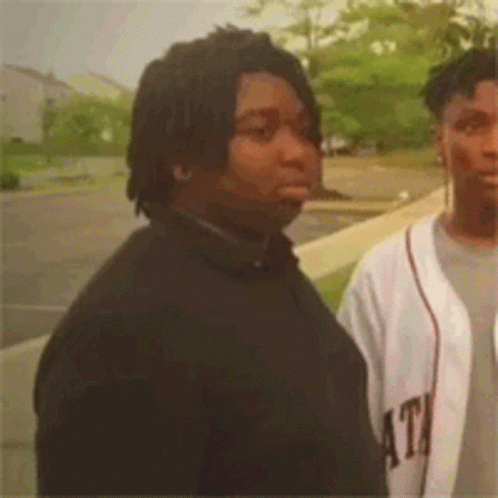

# AITeacher

## Description:
 - This is project developed during Summer Research Program in ISSAI NU (Nazarbaev University in Astana) by Qonus✌️😎, riz3e and himoji.
 - The Idea of the project is to teach young generation with interactive AI kazakh teachers.
 - We plan on improving the original prototype from ISSAI by implementing command system into our AI teacher. Theoretically it will give teacher more freedom and immerse the student into realm of education. Teacher will be able to show relevant media (Images. maybe videos too?), perform animations, change voice with speeking rate and show emotions with AI generated face animations on command. Chat bot will ocasionally use those commands.

## Instructions:
 - clone/download the project from this repository
 - install dependencies listed in requirements.txt
 - enter `python main.py` in project directory terminal to run the program (I'm so sorry for people who got an error message after that, good luck...)
 - Choose preferred input device by typing index shown in terminal
 - Hold [R] key to record yourself

## Currently used api list:
 - (stt.py) faster-whisper for speech to text 
 - (gpt.py) chat gpt 4 as chat bot, main brain of AI
 - (tts.py) edge-tts for text to speech

## Note:
 - There are other scripts labeled "old". They are old solutions I left in project. During development process I had to get rid of them because the solutions were whether too slow just like whisper, or not very accurate/real like in the case of pyttsx3, llama and SpeechRecognition.
 - server.py will be relevant for visual representation of AI soon enough. We will use it to send to and possibly receive messages from Unreal Engine (3D game engine with realistically real graphics, in fact you can't say Unreal Engine without saying "real").